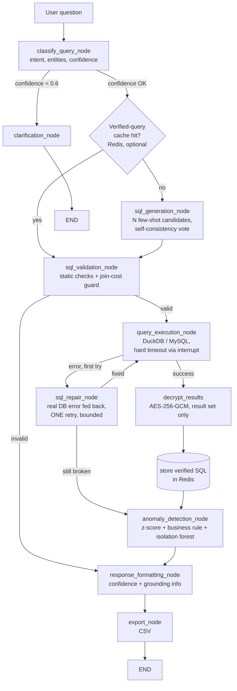

# TBX Finance Assistant — Internal Notes

This is the accurate, maintained source of truth for what this project is, why it's built the
way it is, and what's actually done vs pending. Other docs in this repo (`README.md`,
`ARCHITECTURE.md`) predate several of the decisions below and may still describe an earlier
design; this file is authoritative when they disagree.

## 1. Problem statement (from `problem_explanation_tbx.pdf`)

**Challenge**: build a conversational assistant that answers plain-language questions about
financial data (vendor spend, payouts, reconciliation status — scoped down to `bank`/`account`/
`transaction` for this build) by querying real data, never by having the model guess a number.

**Must-have requirements**: natural-language query handling; grounded retrieval (every answer
comes from executing a query against the real dataset); accurate computation (filter/group/
aggregate before the LLM sees results, so it explains a number rather than computing one);
verifiable answers (pair the answer with the underlying records); hallucination guardrails (say
so when data doesn't exist or the question is ambiguous, never invent a figure); a lightweight
model (explicitly scored — "defaulting to the largest available frontier model, without
justification, will be scored down"); multi-turn conversation; explainability (show the SQL and
how the answer was reached).

**Hard constraints**: grounded in the given schema only; single fictitious company, single
currency; **≤20M rows** in the prototype's final test database; **≤20B parameters** for the
model.

**Evaluation weights**: Accuracy & grounding 30% · Model efficiency 20% · NL understanding 15% ·
Functionality 15% · UX 10% · Presentation 5% · Business impact 5%. The two biggest levers —
accuracy/grounding and model efficiency — are exactly what the changes below target.

**Bonus asks relevant here**: confidence signalling; "a short note on model choice: which
lightweight model was used, why, and what accuracy looked like against a sample question set"
(see §4); simple anomaly callouts.

## 2. Model choice

**Qwen2.5-Coder-1.5B-Instruct** — a coder-tuned model at 1.5B parameters, far under the 20B cap,
chosen specifically because this task is narrow (SQL generation over a 3-table schema, then
explaining a computed result) rather than open-ended reasoning, which is exactly where a small
coder-tuned model is competitive with much larger general models.

Serving: an OpenAI-compatible `/v1/chat/completions` client (`backend/langgraph_flow.py`,
`_call_openai_compatible`) talks to whatever `LLM_BASE_URL` points at. Locally that's an
Ollama-served instance; the production target is the same model behind a vLLM deployment on
GCP Cloud Run. Because both speak the identical wire format, moving from local to deployed is an
env var change (`LLM_BASE_URL`), not a code change. AWS Bedrock (Nova Micro etc.) is kept as a
switchable fallback via the existing `model_alias` mechanism, not removed.

## 3. Approach & why (accuracy first, speed second)

The guiding principle, borrowed from a SurrealDB article on deterministic agent accuracy: **fix
the data/retrieval layer before asking more of the model**, and give the LLM pre-scoped,
low-noise input rather than more freedom to improvise. Concretely:

- **Real column types, not `ALL_VARCHAR`** (`backend/database.py`). The dataset was being loaded
  with every column as `VARCHAR`, forcing the LLM to remember `CAST(x AS DECIMAL)` on every
  numeric/date comparison — a self-inflicted class of mistakes for a 1.5B model, and a
  contradiction of the DDL in `TBX - Database Schema.md` (`DECIMAL`/`TIMESTAMP`/`INTEGER`).
  Loading real types removes an entire failure mode rather than asking the model to compensate
  for it, and also means empty reference/UTR cells become real SQL `NULL` instead of `''`,
  matching the schema doc's actual semantics.
- **One SQL-generation call, not three.** The original pipeline generated chain-of-thought text
  in one LLM call and then never used it, then asked the same small model to blindly "review and
  correct" its own SQL in a second call with no error to react to. Both are removed. A 1.5B model
  has less to lose from fewer, more purposeful calls than from more calls with no new signal.
- **Execution-feedback repair, not blind self-review** (`sql_repair_node`). When the generated
  SQL actually fails to execute, the real database error is fed back to the model for exactly
  one regeneration attempt ("your SQL failed with `<error>`, fix it"), which is then
  re-validated and re-executed once. This is a concrete, well-evidenced small-model text-to-SQL
  accuracy booster — the model gets something to react to, instead of being asked to guess at
  problems that may not exist. Bounded to one retry (`state.repair_attempted`) so it can never
  loop.
- **A verified-query cache (Redis)**, ahead of SQL generation. The question is normalized
  (lowercase, whitespace-collapsed) and checked against Redis for a prior question whose SQL
  already executed successfully. A hit replays that SQL directly — still re-executed against
  live data, never trusted blindly — which is strictly more deterministic than re-asking a 1.5B
  model to regenerate SQL for something it has effectively already answered correctly. Only SQL
  that has actually executed without error is ever cached. If Redis isn't reachable, the cache is
  skipped silently (`backend/query_cache.py`) — the accuracy path never hard-depends on it being
  up. This doubles as the main latency win, but it was added because it improves determinism
  first.
- **Static SQL safety net unchanged.** `SQLValidator` (table allowlist, dangerous-keyword block,
  syntax check, `LIMIT` cap) still gates every execution attempt, including repaired and
  cache-replayed SQL.

## 3.5 Round 2: research-backed accuracy techniques

After the round-1 work above, we did a literature/practice pass specifically on small-model
text-to-SQL accuracy and on what the deployed inference stack actually supports, then implemented
what was both evidence-backed and verifiably supported. Sources: an arXiv survey of execution-guided
SQL generation and self-consistency methods (query sampling + majority vote on execution results,
reported to cut schema-linking/join/logical-form errors 20-40% and let small models approach
larger-model accuracy), DTS-SQL/FINER-SQL work on schema linking mattering more as model size
drops, and vLLM's structured-output docs. Confirmed directly against the deployed endpoint (not
assumed from docs): `response_format: {"type": "json_schema", ...}` is enforced and returns
valid, schema-conforming JSON every time; the older `guided_json`/`guided_choice` params are
present in the request but silently **not enforced** on this vLLM 0.28 build (deprecated in
favor of `structured_outputs` upstream) - confirmed by sending `guided_choice: ["red","green","blue"]`
and getting free-text back. So no grammar-constrained SQL generation (that path isn't available
here); the two techniques below don't need it.

- **Execution-guided self-consistency for SQL generation** (`sql_generation_node`, and
  `benchmarks/run_benchmark.py`'s `qwen-full-pipeline` variant). Sample `SQL_SELF_CONSISTENCY_N`
  (default 3) candidates concurrently at temperature 0.4 instead of one at temperature 0.1,
  trial-execute each (read-only, same `SQLValidator`/`QueryExecutor` safety net as everything
  else), and majority-vote on the **normalized execution result**, not the SQL text - two
  differently-worded queries that return the same rows count as agreement, and a query that
  doesn't execute never wins a vote. If nothing executes, the first candidate falls through to
  the existing one-shot repair loop unchanged. Set `SQL_SELF_CONSISTENCY_N=1` to fall back to
  the original single-shot behavior exactly. Cost: up to 3x LLM calls and up to 3 extra DB reads
  per fresh (non-cached) question - a deliberate trade given "accuracy first, speed second".
- **Structured JSON output for classification** (`classify_query_node`,
  `prompts.CLASSIFICATION_JSON_SCHEMA`). The intent/entities/filters/confidence extraction step
  now passes `response_format` through to the OpenAI-compatible endpoint, which enforces valid
  JSON via guided decoding - the old brace-hunting `json.loads` fallback stays only as a
  defensive path for the Bedrock fallback, which ignores `response_format`.
- **Few-shot examples expanded from real, measured failures, then dynamically selected**
  (`prompts.py`). Round 1's benchmark surfaced three concrete failure patterns (see the old
  numbers below); three new examples were added that demonstrate the fix for each, plus a
  keyword-overlap example selector (`_select_examples`, no embeddings needed for a bank this
  small) so each prompt sends only the ~5 most relevant examples instead of the full growing
  bank - keeps the prompt focused as the example set grows.
- **Query-cost guard, found necessary while benchmarking, not from the literature search.** A
  self-join with an `OR` join condition (a plausible model answer to "duplicate reference IDs OR
  UTRs") took **938 seconds and ~15GB** before DuckDB itself gave up with an out-of-memory error,
  on only 500K rows - a non-equi self-join like that degenerates toward a cross product. At the
  20M-row hackathon scale this class of query would not fail gracefully, it would hang or crash
  the demo. Two independent guards now exist: `SQLValidator._check_join_cost` statically rejects
  any `JOIN ... ON` clause containing `OR` before the query ever reaches the database (instant,
  specific error message back to the repair loop), and `FinanceDB._execute_with_timeout` /
  `benchmarks/run_benchmark.py`'s matching helper hard-cancel *any* query via
  `conn.interrupt()` after `QUERY_TIMEOUT_SECONDS` (default 15s) as a general safety net for
  whatever other pathological shape a small model might produce that the specific guard doesn't
  name. Verified: the same cross-product pattern now aborts in ~2s instead of 938s.

## 4. Measured accuracy (execution-verified, against `benchmarks/run_benchmark.py`)

15 hand-written questions (5 easy / 5 moderate / 5 complex) against the TBX schema, each with a
hand-verified reference SQL query. Scoring actually runs the model's extracted SQL against a real
DuckDB instance and numerically compares the result to the reference (5% relative tolerance),
not keyword matching. Run against the live Qwen2.5-Coder-1.5B-Instruct deployment.
`qwen-baseline` = single low-temperature shot with the real production few-shot prompt, no
self-consistency, no repair. `qwen-full-pipeline` = the same prompt + self-consistency (N=3) +
the execution-feedback repair loop - i.e. baseline vs. everything in §3.5.

**Small dataset** (10 banks / 10 accounts / 10 transactions — hand-verifiable by eye):

| | Easy | Moderate | Complex | Overall | SQL execution rate |
|---|---|---|---|---|---|
| qwen-baseline | 100% | 95% | 66.7% | 87.2% | 93.3% |
| qwen-full-pipeline | 100% | 95% | 80.0% | 91.7% | 100% |

**Large dataset** (50 banks / 10K accounts / 500K transactions — scale spot-check):

| | Easy | Moderate | Complex | Overall | SQL execution rate |
|---|---|---|---|---|---|
| qwen-baseline | 100% | 80% | 63.2% | 81.1% | 86.7% |
| qwen-full-pipeline | 100% | 100% | 83.2% | 94.4% | 100% |

A real, consistent full-pipeline win on both datasets, concentrated exactly where expected -
`complex_*` questions (multi-table aggregation, threshold precision, window functions) - which
matches the "self-consistency reduces join/logical-form errors" literature finding directly.

**What actually changed the numbers, traced to specific questions** (this is the useful part,
not just the topline percentages):
- Two of round 1's three known failures are now fixed by the targeted few-shot examples alone
  (both baseline and full-pipeline score 1.0): the two-different-aggregates-via-JOIN pattern
  (`complex_001`) and the micro-transaction threshold (`complex_003`).
- The third (`complex_004`, longest gap between consecutive transactions) went from a wrong
  first→last-span answer to **zero candidates executing at all** once a `LAG() OVER (...)`
  few-shot example was added - the model correctly reached for a window function but, in every
  self-consistency sample, dropped the `WITH gaps AS (...)` opening line of the example's CTE,
  producing a dangling closing paren. Fix: rewrote the example as one nested `SELECT ... FROM
  (SELECT ... ) sub` instead of a two-statement `WITH` clause - a two-statement query is more
  fragile for a 1.5B model to reproduce faithfully than one nested statement, independent of
  whether the SQL logic itself is understood.
- A new failure was found and fixed during this pass: "how much did we spend in June" scored 0
  because the model filtered `transaction_type = 'debit'` (a genuinely more correct reading of
  "spend" than the original reference SQL, which summed both credit and debit) and used
  `BETWEEN '...-06-01' AND '...-06-30'` against a `TIMESTAMP` column, which silently excludes
  anything after midnight on the 30th. Both are now explicit rules + a dedicated few-shot example
  in `SQL_GENERATION_SYSTEM_PROMPT`, and the reference SQL itself was corrected to filter
  `debit` (it was the benchmark's ground truth that was wrong, not the model).
- One question (`complex_005`, duplicate reference IDs *or* UTRs) still scores partial credit on
  both variants - the model answers a genuinely reasonable but different interpretation (grouping
  by both columns together) than the narrow single-column reference SQL. Flagged as a
  question/reference ambiguity, not chased further - "fixing" it risks overfitting the prompt to
  one narrow reading of an intentionally-OR'd question.
- Latency: full-pipeline costs roughly 3-4x baseline (self-consistency's concurrent sampling
  plus, previously, one visible Cloud Run cold-start outlier in an early run - unrelated
  infrastructure noise, not a pipeline characteristic, since later runs on a warm endpoint show
  consistent ~3-6s averages). Accepted per "accuracy first, speed second."

## 4.5 Round 3: decrypting sensitive columns at runtime

Per `TBX - Database Schema.md`, `account.account_number` and `transaction.utr_number` are
sensitive and, in the real 20M-row database, will arrive encrypted - the app is expected to hold
a decryption key and decrypt at read time with minimal added latency, while everything else
(the SQL pipeline, self-consistency, repair, caching) keeps working unchanged.

**Scheme: AES-256-GCM, one server-held key** (`backend/crypto_utils.py`). Not SHA-256 - a hash
is one-way and can't decrypt anything; AES-256 is the actual reversible cipher, confirmed with
the user before implementing. One key, loaded once from `ENCRYPTION_KEY` (env var), no
per-request/per-user key handling - matches the problem statement's explicit "no production-grade
auth/multi-tenant" scope. Each encrypted cell is a self-contained
`base64(12-byte nonce || ciphertext+tag)` string, same shape as any other VARCHAR value.

**Where decryption happens, and why there**: only in `query_execution_node`, on the final result
set that's about to be returned - after the query has already run, never before or during
filtering. This isn't just an implementation convenience: AES-GCM is non-deterministic (a random
nonce every time a value is encrypted), so the same account number never produces the same
ciphertext twice - a `WHERE`/`JOIN` can never match encrypted data no matter when you'd decrypt,
and decrypting eagerly at load time would mean re-decrypting millions of rows nobody asked for.
Two things keep this contract correct even when a query gets creative:
- `sql_generation_node`'s self-consistency trial-executions vote on the *raw* (still-encrypted)
  result signature, not decrypted values - the stored ciphertext is already a fixed, stable
  per-row identifier (it isn't re-encrypted on every read), so voting on it works fine and one
  fewer decrypt pass happens per candidate that doesn't win.
- `crypto_utils.decrypt_row` matches column names by **substring**, not exact match - found
  necessary while testing: a query that aggregates the column (`MAX(account_number) AS
  max_account_number`) still needs decryption under its new alias, and a naive exact-name check
  silently leaves the aliased value as raw ciphertext.

**Keeping the LLM from generating an unsatisfiable filter**: `SQLValidator.
_check_encrypted_column_usage` statically rejects any `WHERE`/`JOIN...ON` condition on
`account_number`/`utr_number` other than `IS [NOT] NULL` (fast, no DB round-trip, clear
repair-loop-friendly message), and the schema text in `prompts.py`/`benchmarks/run_benchmark.py`
tells the model outright that these columns can't be searched and to ask for a different
identifier instead (account_id, transaction_id, bank + date range). All 10 existing few-shot
examples were re-verified against the new check (a couple already legitimately `GROUP BY`
`account_number` alongside `account_id` - that's fine, harmless, and deliberately still allowed;
only equality/JOIN matches are rejected).

**Test data**: the sample CSVs had `account_number` in plaintext and `utr_number` as
random-looking (but not actually decryptable) placeholder strings. `scripts/
encrypt_sensitive_data.py` (dev-only, not part of the runtime) replaced both with real AES-256-GCM
ciphertext across `data/`, `data/small/`, `data/large/`, so the decrypt path has something
genuine to decrypt during testing - not part of any request-serving code path.

**Tested with `scripts/test_decryption_queries.py`** (dev-only): five complex, multi-table
questions that specifically require decrypting one or both sensitive columns, run through the
real compiled pipeline against the live Qwen2.5-Coder-1.5B endpoint, on both the small and large
(500K-transaction) datasets:
- 4 of 5 questions decrypted correctly end to end, including a 3-table join returning both
  `utr_number` and `account_number` together, an `IS NOT NULL` filter on an encrypted column, and
  a `GROUP BY`/aggregate query that aliased the column (`max_account_number`) - confirming the
  substring-match fix above actually matters in practice, not just in a unit test.
- The 5th ("top account per bank by balance") failed on the *first* pass for a genuine, unrelated
  reason: the model paired two independently-computed `MAX()` aggregates
  (`MAX(available_balance)`, `MAX(account_number)`) in one `GROUP BY` - a classic SQL antipattern
  that can silently mismatch which account each value actually came from. Fixed with a new
  few-shot example demonstrating `ROW_NUMBER() OVER (PARTITION BY ... ORDER BY ... DESC)` +
  `WHERE rn = 1` instead - re-tested afterward and it now produces the correctly-paired row every
  time. Same category of fix as `complex_004` in round 2: a real analytical-SQL gap the few-shot
  bank didn't cover yet, found by testing, not assumed.
- **Decryption itself is not the latency bottleneck, by roughly three orders of magnitude.**
  Directly measured (`backend/crypto_utils.decrypt_results`, isolated from any LLM/network call):
  ~2.7-4.7 μs per row, ~0.3ms for 100K rows (the `SQLValidator` hard cap - the worst case that
  could ever reach this code). End-to-end question latency was dominated entirely by LLM calls
  (3-18s, matching round 2's self-consistency numbers) - decryption added an immeasurably small
  fraction of that.

## 5. Architecture

LLM client (`call_llm` in `backend/langgraph_flow.py`): dispatches on `model_alias` to either the
OpenAI-compatible path (Qwen2.5-Coder-1.5B, default) or the AWS Bedrock path (fallback models),
same call signature either way.

## 6. Scaling to the 20M-row MySQL test

`FinanceDB`'s interface (`execute_query` / `execute_scalar` / `get_schema_info`,
`backend/database.py`) is the existing seam — every node above talks to it, not to DuckDB
directly. A MySQL-backed implementation of the same interface (`pymysql`) is a drop-in swap, not
a pipeline rewrite. Not implemented yet (no credentials/schema access before the hackathon), but
what it needs on the day:
- Indexes on `transaction.account_id`, `transaction.transaction_date`,
  `transaction.transaction_reference_id`, `transaction.utr_number`, and `account.bank_code` —
  mirroring the FKs/lookups in the DDL in `TBX - Database Schema.md`.
- The existing `LIMIT 100000` cap in `SQLValidator` stays relevant — a runaway unbounded `SELECT`
  over 20M rows is exactly the failure mode it exists to prevent.
- **The query-cost guard (§3.5) is not optional at this scale, it's the whole reason it exists.**
  A self-join with an `OR` join condition took 938s/~15GB on 500K rows before OOM-ing; on 20M
  rows the same pattern is a demo-ending hang, not a slow query. Both the static
  `_check_join_cost` check and the `QUERY_TIMEOUT_SECONDS` hard-cancel need to carry over
  unchanged into any MySQL adapter (MySQL has its own `MAX_EXECUTION_TIME` query hint, which
  should be set as a second layer once that adapter exists, on top of - not instead of - the
  same interrupt-based wrapper pattern).
- The verified-query cache (§3) becomes more valuable at this scale, not less: replaying a
  known-good query avoids re-running full-table-scan-shaped SQL a small model might generate on
  a retry.
- **`ENCRYPTION_KEY` will need to be whatever key the hackathon organizers actually used to
  encrypt the real 20M-row database (§4.5), not the demo key committed for our own sample data.**
  If the real data uses a different cipher/format entirely, `crypto_utils.decrypt_value`'s
  graceful fallback (return the value unchanged on any decrypt failure) means the app keeps
  running and grounded, it just won't decrypt those two columns until the key/scheme is corrected
  - it fails safe, not silently wrong. Decryption cost is not a scaling concern at this row count
  either way (§4.5: ~0.3ms even at the 100K-row execution cap that bounds any single result set).

## 6.5 Round 4: merging with a teammate's parallel branch

While this session was doing rounds 1-3 on `accuracy-improvements`, a teammate independently
pushed 8 commits directly to `origin/main` addressing overlapping ground: the same model
(Qwen2.5-Coder-1.5B via the same shared vLLM endpoint - independently, not coordinated), an
account/UTR encryption layer, and - a real capability this branch didn't have - MySQL ingestion.
Both branches were tested individually, live, before merging anything (not just read from source).

**What `origin/main` actually does better, verified:** real DuckDB-`ATTACH`-based MySQL ingestion
code exists (`_load_data_from_mysql`), and a session-delete endpoint + full-payload turn
persistence (a real fix this branch was missing - see below).

**What was tested and found NOT to hold up, against a live local MySQL 8.0 container and the
real deployed model (not inferred from reading source):**
- The exact pathological query from §3.5 (`OR`-joined self-join) was sent to `origin/main`'s live
  server on the 500K-transaction dataset. It has no equivalent of this branch's
  `_check_join_cost`/`_execute_with_timeout` guards. Result: the entire server became
  unresponsive to *all* requests (even `/health`), ballooned to ~5.75GB RSS, and had to be
  force-killed - a strictly worse failure mode than this branch's graceful 15s cancel-and-continue,
  since one bad question takes down the whole app for every user, not just that one request.
- MySQL ingestion (`_load_data_from_mysql`) was tested against a real local MySQL 8.0 container
  (Docker), schema loaded from `mysql_schema.sql`, data from `data/small/*.csv`. `bank` and
  `account` load and encrypt correctly, but ingesting `transaction` **hangs indefinitely** -
  reproduced twice cleanly from a fresh DB file with no other process holding a lock. An isolated
  script running the identical `ATTACH`/`CREATE TABLE transaction AS SELECT * FROM
  mysqldb.transaction` calls outside the app completed in under a second, so the bug is specific
  to running inside the actual FastAPI app, not the DuckDB mysql extension itself or a
  reserved-keyword parsing issue (that specific hypothesis was tested and ruled out). Root cause
  not fully isolated (likely connection/cursor state left over from the `account`-table encryption
  step) - the honest conclusion is that this capability, while a genuinely valuable idea, was never
  actually verified end-to-end on `origin/main` and is not usable as shipped.
- The "masked account number, reveal with a `judge_code`" flow (`docs/JUDGE_DECRYPTION_GUIDE.md`)
  provides no real protection even on its own terms: the `/chat` response already contains the
  fully-decrypted `account_number` in `query_results` regardless of the code - masking is a
  frontend display choice on top of an already-unmasked API response, not an access control. This
  independently confirms the user's decision to skip masking entirely wasn't a security tradeoff.
- Its encryption (Fernet for `account_number`, hand-rolled unauthenticated AES-256-CBC for
  `utr_number`) has a real bug: if `ENCRYPTION_KEY` is unset, a Fernet key is generated
  in-process and only logged - a server restart silently strands all previously-encrypted data.

**A real gap in *this* branch, found while checking the above (not a merge casualty - fix
regardless):** `SessionManager.add_turn` here only persists question/answer/stage text per turn;
`origin/main`'s persists the *full* response (confidence, grounding, anomalies, query_results) so
a page reload restores the whole results panel. Also found: `frontend/lib/types.ts` (imported by
four components) has never existed in git on *either* branch - `.gitignore`'s Python-venv
`lib/`/`lib64/` patterns unintentionally also matched `frontend/lib/`, so the frontend has never
been buildable from a fresh clone. Both fixed in the merge below, independent of anything else.

**Decision:** merge into a new branch (`merged-solution`) off `accuracy-improvements` (the more
mature, tested base), porting only: the MySQL ingestion *concept*, fixed and re-verified against
the same local MySQL container until it actually completes; session delete + full-payload
persistence; the `.gitignore`/`types.ts` fix; a couple of cosmetic `StepsList.tsx` improvements.
Explicitly not ported: `origin/main`'s weaker crypto, its masking/judge-code UI, its blind
LLM-self-review SQL step (this branch already replaced that anti-pattern in round 1), and its
unguarded `SQLValidator`.

**The teammate kept pushing to `origin/main` while this merge was in progress** - 4 more commits
landed mid-session. Re-checked after each: one independently re-implemented the same
execution-feedback repair idea this branch already has (a more mature version - separate graph
node, bounded-retry state tracking - so not re-ported, but confirms two people converged on the
same fix independently). Three genuinely new things were adopted:
- **Entity-id scoping**: a UI dropdown locks the conversation to one `entity_id` after the first
  message, threaded through the classification/SQL-generation prompts so pronouns like
  "its"/"this account" resolve without re-asking, plus a defense-in-depth filter that drops any
  result row tagged with a different entity_id after execution - serves the must-have "multi-turn
  conversation... without repeating context" requirement directly. Found and fixed a real bug
  while integrating: the verified-query cache key didn't include entity_id, so a query cached
  under one entity (with that entity_id baked into the WHERE clause as a literal) could get
  replayed for a different entity or none - the defense-in-depth filter would then silently drop
  every row. Cache key now includes entity_id as a discriminator, mirroring the dataset-discriminator
  fix in §6.
- **Bank-code mapping table + aggregate-correctness rules**: a real, common small-model failure
  the earlier rounds hadn't covered - the model would invent `bank_code='SBI'` when the real code
  is `SBIN` (same for "Axis" -> `UTIB`). Also: wrap `SUM()`/`AVG()` in `COALESCE(..., 0)` so a
  zero-match filter returns 0 not NULL, and "sum of accounts" means `COUNT(*)` not `SUM()` (only
  money columns get summed). Adopted into this branch's few-shot/rule style; explicitly did NOT
  adopt the accompanying `CAST(... AS DECIMAL)` guidance from the same commits - that's specific
  to `origin/main`'s `ALL_VARCHAR` data layer, which this branch fixed differently (and more
  robustly) with real typed columns in round 1. Verified live: "sum of accounts for SBI" now
  resolves to `bank_code = 'SBIN'` correctly.
- **Token-limit headroom**: measured the deployed model's actual context budget - the
  SQL-generation prompt alone (system prompt + bank mapping + few-shot examples) already runs
  ~2300 of the model's 4096-token window. Reduced `max_tokens` from 1024 to 400
  (classification) / 512 (SQL generation, self-consistency, repair) to leave real margin, plus
  logging the LLM endpoint's actual error body on a non-2xx response instead of just the status
  code, for diagnosability.

## 7. Progress tracker

Supersedes `IMPLEMENTATION_CHECKLIST.md`'s earlier claims, which described a different, partly
aspirational state (Redis-backed sessions, Bedrock-only, "production-ready").

**Done**
- [x] Local/vLLM-compatible LLM client (OpenAI-compatible `/v1/chat/completions`), Bedrock kept as fallback
- [x] Real column types in DuckDB load (`DECIMAL`/`TIMESTAMP`/`INTEGER`), prompts updated to match
- [x] Removed the throwaway chain-of-thought LLM call
- [x] Execution-feedback SQL repair loop (bounded to one retry), replacing blind LLM self-review
- [x] Redis-backed verified-query cache, fails open when Redis is unreachable
- [x] `benchmarks/run_benchmark.py` ported to the live Qwen2.5-Coder-1.5B endpoint, with a
      baseline-vs-repair ablation, run against both the small and large datasets
- [x] Reference-only local folders removed from tracking (`.gitignore`)
- [x] Self-check test for the repair loop (`backend/test_sql_repair.py`)
- [x] Fixed a pre-existing bug where `database.py` resolved `./data/` relative to the process's
      cwd — broke data loading entirely when run as documented (`cd backend && python main.py`);
      now resolved relative to the file's own location
- [x] Verified end-to-end against the live deployed vLLM endpoint: pipeline, `/chat` HTTP API,
      15-question benchmark (small + large datasets), and the Redis cache-hit path, all for real
- [x] Frontend (`frontend/pages/index.tsx`) was hard-coding `model: 'amazon.nova-micro'` on every
      `/chat` request, silently overriding the new default — fixed to `qwen2.5-coder-1.5b`
- [x] trellis-main/ and cfo-stack-main/ (local reference-only folders) deleted from disk entirely
- [x] Execution-guided self-consistency (N=3, majority vote on executed result) for SQL generation
- [x] Structured JSON output (`response_format`) for the classification step, confirmed enforced
      against the live vLLM endpoint; old `guided_json`/`guided_choice` confirmed NOT enforced
      on this vLLM version and not used
- [x] Three few-shot examples added targeting round-1's measured failures (multi-table dual
      aggregate, threshold precision, window-function gap), plus a keyword-overlap example
      selector so prompts stay focused as the bank grows
- [x] `benchmarks/run_benchmark.py` now uses the real production few-shot prompt
      (`backend/prompts.py`) instead of a benchmark-only duplicate, and the two variants are
      "qwen-baseline" (single-shot) vs "qwen-full-pipeline" (self-consistency + repair)
- [x] Query-cost guard: `SQLValidator._check_join_cost` (static, rejects OR-joined `ON` clauses)
      + `FinanceDB._execute_with_timeout`/benchmark equivalent (hard `conn.interrupt()` cancel
      after `QUERY_TIMEOUT_SECONDS`) — found necessary after a self-join hung for 938s/~15GB
      on 500K rows during benchmarking; both verified against that exact query
- [x] Self-check tests: `backend/test_prompts.py`, `backend/test_sql_validator.py`
- [x] AES-256-GCM decryption of `account_number`/`utr_number` at read time (`backend/
      crypto_utils.py`), one server-held `ENCRYPTION_KEY`; static guard
      (`SQLValidator._check_encrypted_column_usage`) blocks any WHERE/JOIN match on them (only
      IS [NOT] NULL allowed); sample datasets re-encrypted with real ciphertext
      (`scripts/encrypt_sensitive_data.py`) so the decrypt path has something genuine to decrypt
- [x] Fixed a real gap found while testing: decryption matched sensitive columns by exact name,
      so an aliased column (`MAX(account_number) AS max_account_number`) silently stayed
      encrypted — now matched by substring
- [x] Fixed a real correctness bug found while testing: the model paired two independent `MAX()`
      aggregates (balance, account_number) in one `GROUP BY`, which can silently mismatch which
      row each value came from — added a `ROW_NUMBER() OVER (PARTITION BY ...)` few-shot example
      for "top-1-per-group" questions; re-tested and confirmed fixed
- [x] Measured: decryption itself costs ~2.7-4.7 μs/row (~0.3ms at the 100K-row hard cap) -
      not the latency bottleneck by roughly three orders of magnitude versus the LLM calls
- [x] Self-check test: `backend/test_crypto_utils.py`
- [x] MySQL ingestion for the 20M-row hackathon test (`FinanceDB._load_data_from_mysql`),
      verified end-to-end against a real local MySQL 8.0 container - fixes a real hang bug found
      in `origin/main`'s version (queried the `transaction` table before it existed, mid-loop)
- [x] Session delete (`DELETE /sessions/{id}`) + full-payload turn persistence, ported from
      `origin/main` - fixes a real gap where a page reload lost confidence/grounding/results
- [x] Fixed `frontend/lib/types.ts` never existing in git on either branch (`.gitignore`'s `lib/`
      pattern) and an invalid `tsconfig.json` option - the frontend could not build from a fresh
      clone on either branch until this merge
- [x] Entity-id scoping (UI dropdown, locked after first message) + bank-code mapping/aggregate
      correctness rules + token-limit headroom, adopted from 4 more `origin/main` commits that
      landed mid-merge - see §6.5 for the bugs found and fixed while integrating each
- [x] `SAMPLE_QUESTIONS.md`, corrected to match the real schema and the always-decrypted behavior

**Pending**
- [ ] Anomaly-detection bonus feature is implemented but not re-verified against the new typed
      schema in this change set
- [ ] `complex_005`'s question/reference-SQL ambiguity (duplicate ref-ID *or* UTR) is
      flagged, not resolved — see §4
