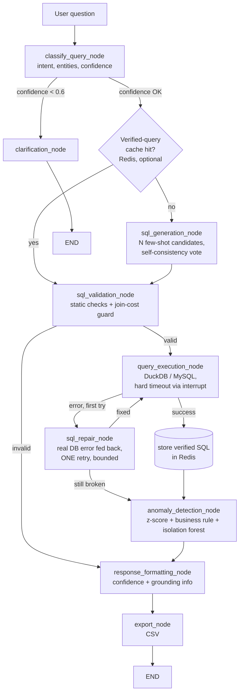

# TBX Finance Assistant — Internal Notes

This is the accurate, maintained source of truth for what this project is, why it's built the
way it is, and what's actually done vs pending. Other docs in this repo (`README.md`,
`ARCHITECTURE.md`) predate several of the decisions below and may still describe an earlier
design; this file is authoritative when they disagree.

## 1. Problem statement (from `problem_explanation_tbx.pdf`)

**Challenge**: build a conversational assistant that answers plain-language questions about
financial data (vendor spend, payouts, reconciliation status — scoped down to `bank`/`account`/
`transaction` for this build) by querying real data, never by having the model guess a number.

**Must-have requirements**: natural-language query handling; grounded retrieval (every answer
comes from executing a query against the real dataset); accurate computation (filter/group/
aggregate before the LLM sees results, so it explains a number rather than computing one);
verifiable answers (pair the answer with the underlying records); hallucination guardrails (say
so when data doesn't exist or the question is ambiguous, never invent a figure); a lightweight
model (explicitly scored — "defaulting to the largest available frontier model, without
justification, will be scored down"); multi-turn conversation; explainability (show the SQL and
how the answer was reached).

**Hard constraints**: grounded in the given schema only; single fictitious company, single
currency; **≤20M rows** in the prototype's final test database; **≤20B parameters** for the
model.

**Evaluation weights**: Accuracy & grounding 30% · Model efficiency 20% · NL understanding 15% ·
Functionality 15% · UX 10% · Presentation 5% · Business impact 5%. The two biggest levers —
accuracy/grounding and model efficiency — are exactly what the changes below target.

**Bonus asks relevant here**: confidence signalling; "a short note on model choice: which
lightweight model was used, why, and what accuracy looked like against a sample question set"
(see §4); simple anomaly callouts.

## 2. Model choice

**Qwen2.5-Coder-1.5B-Instruct** — a coder-tuned model at 1.5B parameters, far under the 20B cap,
chosen specifically because this task is narrow (SQL generation over a 3-table schema, then
explaining a computed result) rather than open-ended reasoning, which is exactly where a small
coder-tuned model is competitive with much larger general models.

Serving: an OpenAI-compatible `/v1/chat/completions` client (`backend/langgraph_flow.py`,
`_call_openai_compatible`) talks to whatever `LLM_BASE_URL` points at. Locally that's an
Ollama-served instance; the production target is the same model behind a vLLM deployment on
GCP Cloud Run. Because both speak the identical wire format, moving from local to deployed is an
env var change (`LLM_BASE_URL`), not a code change. AWS Bedrock (Nova Micro etc.) is kept as a
switchable fallback via the existing `model_alias` mechanism, not removed.

## 3. Approach & why (accuracy first, speed second)

The guiding principle, borrowed from a SurrealDB article on deterministic agent accuracy: **fix
the data/retrieval layer before asking more of the model**, and give the LLM pre-scoped,
low-noise input rather than more freedom to improvise. Concretely:

- **Real column types, not `ALL_VARCHAR`** (`backend/database.py`). The dataset was being loaded
  with every column as `VARCHAR`, forcing the LLM to remember `CAST(x AS DECIMAL)` on every
  numeric/date comparison — a self-inflicted class of mistakes for a 1.5B model, and a
  contradiction of the DDL in `TBX - Database Schema.md` (`DECIMAL`/`TIMESTAMP`/`INTEGER`).
  Loading real types removes an entire failure mode rather than asking the model to compensate
  for it, and also means empty reference/UTR cells become real SQL `NULL` instead of `''`,
  matching the schema doc's actual semantics.
- **One SQL-generation call, not three.** The original pipeline generated chain-of-thought text
  in one LLM call and then never used it, then asked the same small model to blindly "review and
  correct" its own SQL in a second call with no error to react to. Both are removed. A 1.5B model
  has less to lose from fewer, more purposeful calls than from more calls with no new signal.
- **Execution-feedback repair, not blind self-review** (`sql_repair_node`). When the generated
  SQL actually fails to execute, the real database error is fed back to the model for exactly
  one regeneration attempt ("your SQL failed with `<error>`, fix it"), which is then
  re-validated and re-executed once. This is a concrete, well-evidenced small-model text-to-SQL
  accuracy booster — the model gets something to react to, instead of being asked to guess at
  problems that may not exist. Bounded to one retry (`state.repair_attempted`) so it can never
  loop.
- **A verified-query cache (Redis)**, ahead of SQL generation. The question is normalized
  (lowercase, whitespace-collapsed) and checked against Redis for a prior question whose SQL
  already executed successfully. A hit replays that SQL directly — still re-executed against
  live data, never trusted blindly — which is strictly more deterministic than re-asking a 1.5B
  model to regenerate SQL for something it has effectively already answered correctly. Only SQL
  that has actually executed without error is ever cached. If Redis isn't reachable, the cache is
  skipped silently (`backend/query_cache.py`) — the accuracy path never hard-depends on it being
  up. This doubles as the main latency win, but it was added because it improves determinism
  first.
- **Static SQL safety net unchanged.** `SQLValidator` (table allowlist, dangerous-keyword block,
  syntax check, `LIMIT` cap) still gates every execution attempt, including repaired and
  cache-replayed SQL.

## 3.5 Round 2: research-backed accuracy techniques

After the round-1 work above, we did a literature/practice pass specifically on small-model
text-to-SQL accuracy and on what the deployed inference stack actually supports, then implemented
what was both evidence-backed and verifiably supported. Sources: an arXiv survey of execution-guided
SQL generation and self-consistency methods (query sampling + majority vote on execution results,
reported to cut schema-linking/join/logical-form errors 20-40% and let small models approach
larger-model accuracy), DTS-SQL/FINER-SQL work on schema linking mattering more as model size
drops, and vLLM's structured-output docs. Confirmed directly against the deployed endpoint (not
assumed from docs): `response_format: {"type": "json_schema", ...}` is enforced and returns
valid, schema-conforming JSON every time; the older `guided_json`/`guided_choice` params are
present in the request but silently **not enforced** on this vLLM 0.28 build (deprecated in
favor of `structured_outputs` upstream) - confirmed by sending `guided_choice: ["red","green","blue"]`
and getting free-text back. So no grammar-constrained SQL generation (that path isn't available
here); the two techniques below don't need it.

- **Execution-guided self-consistency for SQL generation** (`sql_generation_node`, and
  `benchmarks/run_benchmark.py`'s `qwen-full-pipeline` variant). Sample `SQL_SELF_CONSISTENCY_N`
  (default 3) candidates concurrently at temperature 0.4 instead of one at temperature 0.1,
  trial-execute each (read-only, same `SQLValidator`/`QueryExecutor` safety net as everything
  else), and majority-vote on the **normalized execution result**, not the SQL text - two
  differently-worded queries that return the same rows count as agreement, and a query that
  doesn't execute never wins a vote. If nothing executes, the first candidate falls through to
  the existing one-shot repair loop unchanged. Set `SQL_SELF_CONSISTENCY_N=1` to fall back to
  the original single-shot behavior exactly. Cost: up to 3x LLM calls and up to 3 extra DB reads
  per fresh (non-cached) question - a deliberate trade given "accuracy first, speed second".
- **Structured JSON output for classification** (`classify_query_node`,
  `prompts.CLASSIFICATION_JSON_SCHEMA`). The intent/entities/filters/confidence extraction step
  now passes `response_format` through to the OpenAI-compatible endpoint, which enforces valid
  JSON via guided decoding - the old brace-hunting `json.loads` fallback stays only as a
  defensive path for the Bedrock fallback, which ignores `response_format`.
- **Few-shot examples expanded from real, measured failures, then dynamically selected**
  (`prompts.py`). Round 1's benchmark surfaced three concrete failure patterns (see the old
  numbers below); three new examples were added that demonstrate the fix for each, plus a
  keyword-overlap example selector (`_select_examples`, no embeddings needed for a bank this
  small) so each prompt sends only the ~5 most relevant examples instead of the full growing
  bank - keeps the prompt focused as the example set grows.
- **Query-cost guard, found necessary while benchmarking, not from the literature search.** A
  self-join with an `OR` join condition (a plausible model answer to "duplicate reference IDs OR
  UTRs") took **938 seconds and ~15GB** before DuckDB itself gave up with an out-of-memory error,
  on only 500K rows - a non-equi self-join like that degenerates toward a cross product. At the
  20M-row hackathon scale this class of query would not fail gracefully, it would hang or crash
  the demo. Two independent guards now exist: `SQLValidator._check_join_cost` statically rejects
  any `JOIN ... ON` clause containing `OR` before the query ever reaches the database (instant,
  specific error message back to the repair loop), and `FinanceDB._execute_with_timeout` /
  `benchmarks/run_benchmark.py`'s matching helper hard-cancel *any* query via
  `conn.interrupt()` after `QUERY_TIMEOUT_SECONDS` (default 15s) as a general safety net for
  whatever other pathological shape a small model might produce that the specific guard doesn't
  name. Verified: the same cross-product pattern now aborts in ~2s instead of 938s.

## 4. Measured accuracy (execution-verified, against `benchmarks/run_benchmark.py`)

15 hand-written questions (5 easy / 5 moderate / 5 complex) against the TBX schema, each with a
hand-verified reference SQL query. Scoring actually runs the model's extracted SQL against a real
DuckDB instance and numerically compares the result to the reference (5% relative tolerance),
not keyword matching. Run against the live Qwen2.5-Coder-1.5B-Instruct deployment.
`qwen-baseline` = single low-temperature shot with the real production few-shot prompt, no
self-consistency, no repair. `qwen-full-pipeline` = the same prompt + self-consistency (N=3) +
the execution-feedback repair loop - i.e. baseline vs. everything in §3.5.

**Small dataset** (10 banks / 10 accounts / 10 transactions — hand-verifiable by eye):

| | Easy | Moderate | Complex | Overall | SQL execution rate |
|---|---|---|---|---|---|
| qwen-baseline | 100% | 95% | 66.7% | 87.2% | 93.3% |
| qwen-full-pipeline | 100% | 95% | 80.0% | 91.7% | 100% |

**Large dataset** (50 banks / 10K accounts / 500K transactions — scale spot-check):

| | Easy | Moderate | Complex | Overall | SQL execution rate |
|---|---|---|---|---|---|
| qwen-baseline | 100% | 80% | 63.2% | 81.1% | 86.7% |
| qwen-full-pipeline | 100% | 100% | 83.2% | 94.4% | 100% |

A real, consistent full-pipeline win on both datasets, concentrated exactly where expected -
`complex_*` questions (multi-table aggregation, threshold precision, window functions) - which
matches the "self-consistency reduces join/logical-form errors" literature finding directly.

**What actually changed the numbers, traced to specific questions** (this is the useful part,
not just the topline percentages):
- Two of round 1's three known failures are now fixed by the targeted few-shot examples alone
  (both baseline and full-pipeline score 1.0): the two-different-aggregates-via-JOIN pattern
  (`complex_001`) and the micro-transaction threshold (`complex_003`).
- The third (`complex_004`, longest gap between consecutive transactions) went from a wrong
  first→last-span answer to **zero candidates executing at all** once a `LAG() OVER (...)`
  few-shot example was added - the model correctly reached for a window function but, in every
  self-consistency sample, dropped the `WITH gaps AS (...)` opening line of the example's CTE,
  producing a dangling closing paren. Fix: rewrote the example as one nested `SELECT ... FROM
  (SELECT ... ) sub` instead of a two-statement `WITH` clause - a two-statement query is more
  fragile for a 1.5B model to reproduce faithfully than one nested statement, independent of
  whether the SQL logic itself is understood.
- A new failure was found and fixed during this pass: "how much did we spend in June" scored 0
  because the model filtered `transaction_type = 'debit'` (a genuinely more correct reading of
  "spend" than the original reference SQL, which summed both credit and debit) and used
  `BETWEEN '...-06-01' AND '...-06-30'` against a `TIMESTAMP` column, which silently excludes
  anything after midnight on the 30th. Both are now explicit rules + a dedicated few-shot example
  in `SQL_GENERATION_SYSTEM_PROMPT`, and the reference SQL itself was corrected to filter
  `debit` (it was the benchmark's ground truth that was wrong, not the model).
- One question (`complex_005`, duplicate reference IDs *or* UTRs) still scores partial credit on
  both variants - the model answers a genuinely reasonable but different interpretation (grouping
  by both columns together) than the narrow single-column reference SQL. Flagged as a
  question/reference ambiguity, not chased further - "fixing" it risks overfitting the prompt to
  one narrow reading of an intentionally-OR'd question.
- Latency: full-pipeline costs roughly 3-4x baseline (self-consistency's concurrent sampling
  plus, previously, one visible Cloud Run cold-start outlier in an early run - unrelated
  infrastructure noise, not a pipeline characteristic, since later runs on a warm endpoint show
  consistent ~3-6s averages). Accepted per "accuracy first, speed second."

## 5. Architecture

LLM client (`call_llm` in `backend/langgraph_flow.py`): dispatches on `model_alias` to either the
OpenAI-compatible path (Qwen2.5-Coder-1.5B, default) or the AWS Bedrock path (fallback models),
same call signature either way.

## 6. Scaling to the 20M-row MySQL test

`FinanceDB`'s interface (`execute_query` / `execute_scalar` / `get_schema_info`,
`backend/database.py`) is the existing seam — every node above talks to it, not to DuckDB
directly. A MySQL-backed implementation of the same interface (`pymysql`) is a drop-in swap, not
a pipeline rewrite. Not implemented yet (no credentials/schema access before the hackathon), but
what it needs on the day:
- Indexes on `transaction.account_id`, `transaction.transaction_date`,
  `transaction.transaction_reference_id`, `transaction.utr_number`, and `account.bank_code` —
  mirroring the FKs/lookups in the DDL in `TBX - Database Schema.md`.
- The existing `LIMIT 100000` cap in `SQLValidator` stays relevant — a runaway unbounded `SELECT`
  over 20M rows is exactly the failure mode it exists to prevent.
- **The query-cost guard (§3.5) is not optional at this scale, it's the whole reason it exists.**
  A self-join with an `OR` join condition took 938s/~15GB on 500K rows before OOM-ing; on 20M
  rows the same pattern is a demo-ending hang, not a slow query. Both the static
  `_check_join_cost` check and the `QUERY_TIMEOUT_SECONDS` hard-cancel need to carry over
  unchanged into any MySQL adapter (MySQL has its own `MAX_EXECUTION_TIME` query hint, which
  should be set as a second layer once that adapter exists, on top of - not instead of - the
  same interrupt-based wrapper pattern).
- The verified-query cache (§3) becomes more valuable at this scale, not less: replaying a
  known-good query avoids re-running full-table-scan-shaped SQL a small model might generate on
  a retry.

## 7. Progress tracker

Supersedes `IMPLEMENTATION_CHECKLIST.md`'s earlier claims, which described a different, partly
aspirational state (Redis-backed sessions, Bedrock-only, "production-ready").

**Done**
- [x] Local/vLLM-compatible LLM client (OpenAI-compatible `/v1/chat/completions`), Bedrock kept as fallback
- [x] Real column types in DuckDB load (`DECIMAL`/`TIMESTAMP`/`INTEGER`), prompts updated to match
- [x] Removed the throwaway chain-of-thought LLM call
- [x] Execution-feedback SQL repair loop (bounded to one retry), replacing blind LLM self-review
- [x] Redis-backed verified-query cache, fails open when Redis is unreachable
- [x] `benchmarks/run_benchmark.py` ported to the live Qwen2.5-Coder-1.5B endpoint, with a
      baseline-vs-repair ablation, run against both the small and large datasets
- [x] Reference-only local folders removed from tracking (`.gitignore`)
- [x] Self-check test for the repair loop (`backend/test_sql_repair.py`)
- [x] Fixed a pre-existing bug where `database.py` resolved `./data/` relative to the process's
      cwd — broke data loading entirely when run as documented (`cd backend && python main.py`);
      now resolved relative to the file's own location
- [x] Verified end-to-end against the live deployed vLLM endpoint: pipeline, `/chat` HTTP API,
      15-question benchmark (small + large datasets), and the Redis cache-hit path, all for real
- [x] Frontend (`frontend/pages/index.tsx`) was hard-coding `model: 'amazon.nova-micro'` on every
      `/chat` request, silently overriding the new default — fixed to `qwen2.5-coder-1.5b`
- [x] trellis-main/ and cfo-stack-main/ (local reference-only folders) deleted from disk entirely
- [x] Execution-guided self-consistency (N=3, majority vote on executed result) for SQL generation
- [x] Structured JSON output (`response_format`) for the classification step, confirmed enforced
      against the live vLLM endpoint; old `guided_json`/`guided_choice` confirmed NOT enforced
      on this vLLM version and not used
- [x] Three few-shot examples added targeting round-1's measured failures (multi-table dual
      aggregate, threshold precision, window-function gap), plus a keyword-overlap example
      selector so prompts stay focused as the bank grows
- [x] `benchmarks/run_benchmark.py` now uses the real production few-shot prompt
      (`backend/prompts.py`) instead of a benchmark-only duplicate, and the two variants are
      "qwen-baseline" (single-shot) vs "qwen-full-pipeline" (self-consistency + repair)
- [x] Query-cost guard: `SQLValidator._check_join_cost` (static, rejects OR-joined `ON` clauses)
      + `FinanceDB._execute_with_timeout`/benchmark equivalent (hard `conn.interrupt()` cancel
      after `QUERY_TIMEOUT_SECONDS`) — found necessary after a self-join hung for 938s/~15GB
      on 500K rows during benchmarking; both verified against that exact query
- [x] Self-check tests: `backend/test_prompts.py`, `backend/test_sql_validator.py`

**Pending**
- [ ] MySQL adapter for the 20M-row hackathon database (blocked on credentials/schema access) —
      carry the query-cost guard over, see §6
- [ ] Anomaly-detection bonus feature is implemented but not re-verified against the new typed
      schema in this change set
- [ ] `complex_005`'s question/reference-SQL ambiguity (duplicate ref-ID *or* UTR) is
      flagged, not resolved — see §4
