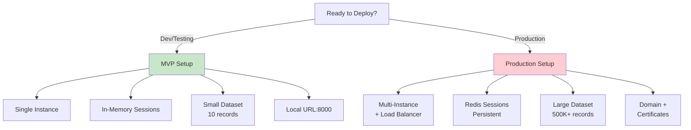
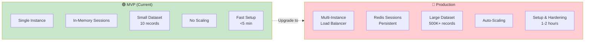
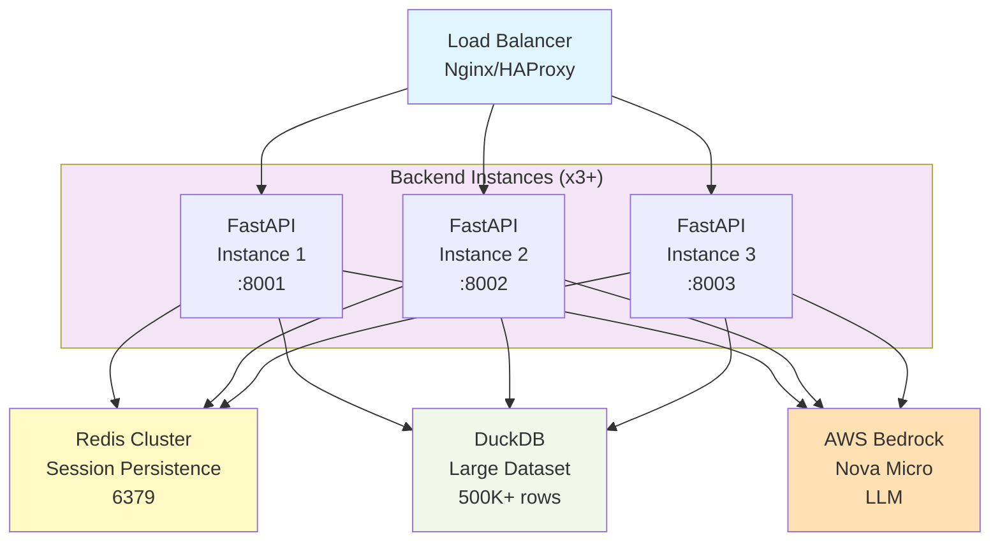

# TBX Finance Assistant — MVP & Production Deployment

> 📚 **Full Docs**: See [DOCS.md](DOCS.md) for all guides and references

## Deployment Decision Tree



## MVP Phase (Current)

### Architecture
- **Frontend**: React + Next.js (local dev)
- **Backend**: FastAPI with in-process session management (no Redis required)
- **Database**: DuckDB with small/large dataset switching
- **LLM Pipeline**: LangGraph agentic loop with Amazon Nova Micro (1.3B params) via AWS Bedrock

### Running MVP Locally

```bash
# Backend
cd backend
pip install -r requirements.txt
python main.py
# Runs on http://localhost:8000

# Frontend (new terminal)
cd frontend
npm install
npm run dev
# Runs on http://localhost:3000
```

### MVP Database

- **Active Dataset**: Small (10 records per table)
- **Location**: `data/` directory
- **Switching**: Use `FinanceDB(dataset="small" or "large")`
- **Schema**: TBX (bank, account, transaction)

```python
from backend.database import FinanceDB

# MVP uses small dataset by default
db = FinanceDB(dataset="small")
stats = db.get_dataset_stats()
```

### MVP Features

✅ Conversational AI queries
✅ Natural language to SQL generation
✅ Session management (in-memory)
✅ Data export (CSV)
✅ Anomaly detection (statistical + ML)
✅ Small dataset for quick testing

### MVP Limitations

- No persistent session storage (in-memory only)
- Single backend instance (no horizontal scaling)
- Small dataset (10 records)
- No production security hardening

---

## Production Deployment

### Key Differences

### MVP vs Production Comparison



| Aspect | MVP | Production |
|--------|-----|-----------|
| Sessions | In-memory | Redis |
| Dataset | Small (10 rec) | Large (500K+ rec) |
| Scale | Single instance | Multi-instance + LB |
| CORS | `["*"]` | Restricted list |
| Server | `uvicorn --reload` | Gunicorn + workers |
| Persistence | None | Redis persistence |

### Production Architecture



### Production Requirements

1. **Redis Setup** (for session persistence)
2. **Docker/Compose** (for containerization)
3. **Load Balancer** (for multi-instance deployment)
4. **Environment Configuration** (for secrets, endpoints)
5. **Large Dataset** (for production workload)

### Docker / Redis

Create `docker-compose.yml` for production:

```yaml
version: '3.8'
services:
  redis:
    image: redis:7-alpine
    ports:
      - "6379:6379"
    volumes:
      - redis_data:/data
    command: redis-server --appendonly yes
    healthcheck:
      test: ["CMD", "redis-cli", "ping"]
      interval: 5s
      timeout: 3s
      retries: 5
    networks:
      - finance-assistant

  backend:
    build: ./backend
    ports:
      - "8000:8000"
    environment:
      REDIS_HOST: redis
      REDIS_PORT: 6379
      REDIS_DB: 0
      DATABASE_MODE: large
    depends_on:
      redis:
        condition: service_healthy
    networks:
      - finance-assistant

  frontend:
    build: ./frontend
    ports:
      - "3000:3000"
    environment:
      NEXT_PUBLIC_API_URL: http://backend:8000
    networks:
      - finance-assistant

volumes:
  redis_data:

networks:
  finance-assistant:
    driver: bridge
```

Run with:
```bash
docker compose up -d
```

### Redis-backed Session Manager

To enable Redis for production, update [backend/main.py](backend/main.py):

1. **Install Redis client**:
   ```bash
   pip install redis==5.0.0
   ```

2. **Update SessionManager** (in `backend/main.py`):
   ```python
   import redis
   import json
   from typing import Dict, List
   
   class SessionManager:
       def __init__(self, redis_client: redis.Redis):
           self.redis = redis_client
       
       def create_session(self, session_id: str) -> Dict:
           data = {"messages": [], "created_at": datetime.now().isoformat()}
           self.redis.hset(f"session:{session_id}", mapping={
               "messages": json.dumps([]),
               "created_at": data["created_at"]
           })
           self.redis.expire(f"session:{session_id}", 86400)  # 24-hour TTL
           return data
       
       def get_session(self, session_id: str) -> Dict:
           data = self.redis.hgetall(f"session:{session_id}")
           if not data:
               return None
           return {
               "session_id": session_id,
               "messages": json.loads(data.get("messages", "[]")),
               "created_at": data.get("created_at")
           }
       
       def add_turn(self, session_id: str, role: str, content: str) -> None:
           session = self.get_session(session_id)
           if session:
               session["messages"].append({"role": role, "content": content})
               self.redis.hset(f"session:{session_id}", "messages", json.dumps(session["messages"]))
               self.redis.expire(f"session:{session_id}", 86400)
   ```

3. **Initialize Redis in main.py**:
   ```python
   redis_client = redis.Redis(
       host=os.getenv("REDIS_HOST", "localhost"),
       port=int(os.getenv("REDIS_PORT", 6379)),
       db=int(os.getenv("REDIS_DB", 0)),
       decode_responses=True,
   )
   redis_client.ping()
   session_manager = SessionManager(redis_client)
   ```

4. **Set environment variables**:
   ```bash
   export REDIS_HOST=redis
   export REDIS_PORT=6379
   export REDIS_DB=0
   ```

### Large Dataset for Production

Configure backend to load large dataset:

```python
# In backend/main.py or config
DATABASE_MODE = os.getenv("DATABASE_MODE", "large")
db = FinanceDB(dataset=DATABASE_MODE)
```

Dataset statistics:
- 50 banks
- 10,000 accounts
- 507,200+ transactions
- All edge cases (NULL fields, extreme amounts, encrypted UTRs, special characters)

### Production Security Hardening

1. **CORS Configuration**:
   ```python
   from fastapi.middleware.cors import CORSMiddleware
   
   app.add_middleware(
       CORSMiddleware,
       allow_origins=os.getenv("ALLOWED_ORIGINS", "").split(","),
       allow_credentials=True,
       allow_methods=["GET", "POST"],
       allow_headers=["*"],
   )
   ```

2. **ASGI Server** (Gunicorn):
   ```bash
   pip install gunicorn
   gunicorn -w 4 -k uvicorn.workers.UvicornWorker backend.main:app
   ```

3. **Environment Secrets**:
   - Use `.env.production` (do NOT commit)
   - Set `AWS_ACCESS_KEY_ID`, `AWS_SECRET_ACCESS_KEY` for Bedrock
   - Set `REDIS_HOST`, `REDIS_PASSWORD` (if password-protected)
   - Set `ALLOWED_ORIGINS` for CORS

4. **Load Balancer** (e.g., Nginx):
   ```nginx
   upstream backend {
       server backend:8000;
       server backend2:8000;
   }
   
   server {
       listen 80;
       location / {
           proxy_pass http://backend;
           proxy_set_header Host $host;
       }
   }
   ```

### Production Monitoring

- Log aggregation (ELK stack, CloudWatch)
- Performance metrics (Prometheus + Grafana)
- Session/Redis monitoring
- Error tracking (Sentry)
- Query latency tracking

### Production Checklist

- [ ] Redis configured with persistence (`--appendonly yes`)
- [ ] SessionManager switched to Redis backend
- [ ] Large dataset loaded
- [ ] CORS restricted to allowed domains
- [ ] Gunicorn/ASGI production server configured
- [ ] Environment variables set (secrets in `.env.production`)
- [ ] Database connection pooling configured
- [ ] LLM API credentials secured
- [ ] Logging and monitoring set up
- [ ] Rate limiting configured
- [ ] Database backups scheduled
- [ ] Load tests passed

---

## Environment Variables

### MVP
```
DATASET_MODE=small
```

### Production
```
DATASET_MODE=large
REDIS_HOST=redis
REDIS_PORT=6379
REDIS_DB=0
AWS_REGION=us-west-2
ALLOWED_ORIGINS=https://app.example.com,https://www.example.com
LOG_LEVEL=INFO
```

---

## Deployment Steps (Production)

1. **Prepare infrastructure** (Redis, load balancer, logging)
2. **Build Docker images** (`docker build -t tbx-backend ./backend`)
3. **Update environment variables** in `docker-compose.yml`
4. **Run production compose** (`docker compose -f docker-compose.prod.yml up -d`)
5. **Verify Redis connectivity** (`redis-cli ping`)
6. **Run smoke tests** (hit API endpoints)
7. **Monitor logs** for errors
8. **Gradual rollout** (canary deployment)

---

## Rollback Plan

If production issues occur:

1. Keep previous Docker image tagged
2. Scale down new version: `docker compose scale backend=0`
3. Scale up previous version: `docker service update --image <old-image> backend`
4. Verify Redis state persists (no data loss)
5. Review logs for root cause

---

## References

- [TBX Database Schema](TBX%20-%20Database%20Schema.md)
- [Dataset Integration Guide](DATASET_INTEGRATION.md)
- [Architecture Overview](ARCHITECTURE.md)
- [Implementation Checklist](IMPLEMENTATION_CHECKLIST.md)

