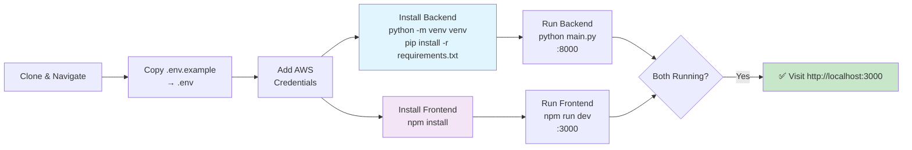
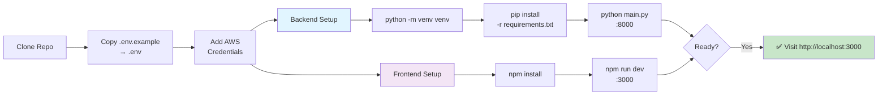
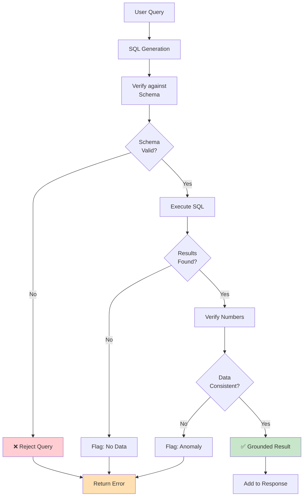
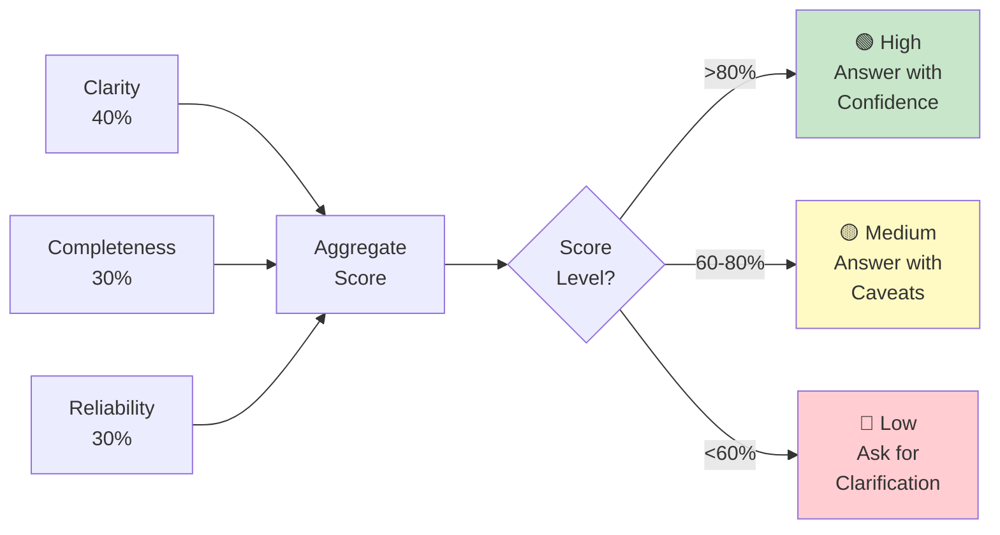

# TBX Finance Assistant

**Conversational AI Assistant for Financial Data Queries**

> 📚 **Full Documentation**: See [DOCS.md](DOCS.md) for complete index, quick start, and all guides

## Overview

A sophisticated finance assistant that understands natural language questions about financial data and returns accurate, grounded answers. Built with LangGraph, Amazon Nova Micro, FastAPI, and DuckDB.

### Key Features
- 🤖 **Natural Language Understanding**: Parse complex financial questions
- 🔍 **Grounded Retrieval**: SQL generation from NLP (not hallucination)
- 📊 **Multi-turn Conversations**: Context retention across sessions
- 🚨 **Anomaly Detection**: Hybrid approach (statistical + ML + business rules)
- 📈 **Confidence Signaling**: Transparent about answer certainty
- 💾 **Data Export**: CSV breakdown tables
- 🔐 **Account Encryption**: Sensitive account data encrypted by default

## Architecture

```
┌─────────────────────────────────────────────────────────────┐
│                    React + Next.js Frontend                  │
│                  (Chat Interface + Sessions)                 │
└────────────────────────┬────────────────────────────────────┘
                         │ HTTP/WebSocket
                         ▼
┌─────────────────────────────────────────────────────────────┐
│                      FastAPI Backend                         │
│  ├─ Session Management (Redis)                              │
│  ├─ Chat Endpoints                                           │
│  └─ Export/Download                                          │
└────────────────────────┬────────────────────────────────────┘
                         │
        ┌────────────────┼────────────────┐
        ▼                ▼                ▼
   ┌─────────┐   ┌──────────────┐   ┌────────────┐
   │LangGraph│   │  DuckDB      │   │   Redis    │
   │ Agentic │──▶│ Financial    │   │  Sessions  │
   │  Loop   │   │ Database     │   │  + Cache   │
   └────┬────┘   └──────────────┘   └────────────┘
        │
        │ Nodes:
        ├─ Classify (intent, entities, confidence)
        ├─ Clarify (if needed)
        ├─ SQL Generation (few-shot + CoT)
        ├─ SQL Validation (static + LLM)
        ├─ Query Execution
        ├─ Anomaly Detection (hybrid)
        ├─ Response Formatting
        └─ Export
        │
        ▼
   ┌──────────────────────────────────────────┐
   │   AWS Bedrock (Amazon Nova Micro)        │
   │   - 1.3B parameters                      │
   │   - PS Section 7 compliant (<=20B params)│
   │   - Low-latency, cost-efficient          │
   └──────────────────────────────────────────┘
```

## Project Structure

```
tbx_finance_assistant/
├── backend/
│   ├── main.py                  # FastAPI app
│   ├── langgraph_flow.py        # LangGraph orchestration
│   ├── database.py              # DuckDB wrapper
│   ├── prompts.py               # LLM prompts + few-shot examples
│   ├── sql_validator.py         # SQL validation
│   ├── tools.py                 # Query execution, anomaly detection, export
│   ├── requirements.txt
│   └── logs/
├── frontend/
│   ├── package.json
│   ├── pages/
│   │   ├── index.tsx            # Main chat interface
│   │   └── sessions.tsx
│   ├── components/
│   │   ├── ChatWindow.tsx
│   │   ├── SessionManager.tsx
│   │   └── ResponseDisplay.tsx
│   └── public/
├── benchmarks/
│   ├── run_benchmark.py         # Benchmark suite
│   ├── results/                 # Benchmark results
│   └── test_questions.json
├── data/
│   ├── transactions.csv         (100K rows, 11.2 MB)
│   ├── vendor_payouts.csv       (100K+ rows, 0.4 MB)
│   ├── reconciliation_status.csv (5.1 MB)
│   ├── chart_of_accounts.csv
│   └── vendor_list.csv
├── .env.example
├── .env                         # Your credentials (not in git)
├── README.md
└── docker-compose.yml           # Local Redis + services

```

## Setup Instructions

### Setup Flow Diagram



### Prerequisites
- Python 3.10+, Node.js 18+
- AWS Account (Bedrock)
- MySQL optional

### Quick Start



**Backend:**
```bash
python -m venv venv
venv\Scripts\activate  # Windows or source venv/bin/activate (Mac/Linux)
cd backend
pip install -r requirements.txt
python main.py  # Runs on http://localhost:8000
```

**Frontend:**
```bash
cd frontend
npm install
npm run dev  # Runs on http://localhost:3000
```

**Configuration:**
1. Copy `.env.example` → `.env`
2. Add AWS credentials (HUGGINGFACE_API_KEY, AWS_ACCESS_KEY_ID, AWS_SECRET_ACCESS_KEY, AWS_REGION)
3. Encryption auto-configured with ENCRYPTION_KEY & DECRYPTION_CODES

See [DOCS.md](DOCS.md) for detailed setup by role

### 5. Database Initialization

DuckDB automatically loads CSV files from `./data/` and encrypts account numbers on startup.

```bash
# Verify database
python -c "from database import get_db; db = get_db(); print('Database ready')"
```

## Security Feature: Account Number Encryption ✨

**All account numbers are encrypted in the database and masked in query results.**

### How It Works
1. 🔒 Account numbers are automatically encrypted when data loads
2. 📊 Query results show masked numbers (e.g., `****3729069`)
3. 🔓 Decrypt via frontend UI or `/decrypt` API with your code
4. ✅ Only valid decryption codes can reveal account numbers

### For End Users (Frontend)
1. Run a query that returns account data
2. Enter your decryption code in the "Decryption Panel"
3. Click "Decrypt" button next to encrypted account numbers
4. Account numbers are revealed

### For Evaluators/API Users
```bash
# After getting query results with account_number_encrypted field:
curl -X POST http://localhost:8000/decrypt \
  -H "Content-Type: application/json" \
  -d '{
    "encrypted_account_number": "gAAAAABl9sX5...",
    "decryption_code": "judge_code"
  }'
# Returns: {"success": true, "account_number": "50200013729069"}
```

**📖 See [JUDGE_DECRYPTION_GUIDE.md](JUDGE_DECRYPTION_GUIDE.md) for quick reference**  
**📚 See [ACCOUNT_ENCRYPTION.md](ACCOUNT_ENCRYPTION.md) for technical details**

## API Endpoints

### Core Chat API
**Base URL**: `http://localhost:8000`

| Method | Endpoint | Description |
|--------|----------|-------------|
| `POST` | `/chat` | Send message to assistant, get grounded response |
| `POST` | `/sessions/create` | Create new session |
| `GET` | `/sessions` | List all sessions |
| `GET` | `/sessions/{session_id}` | Get session info & metadata |
| `GET` | `/sessions/{session_id}/messages` | Get all messages in session |
| `DELETE` | `/sessions/{session_id}` | Delete session |

### Export & Security
| Method | Endpoint | Description |
|--------|----------|-------------|
| `POST` | `/export` | Export query results as CSV |
| `POST` | `/decrypt` | Decrypt masked account numbers (judge access) |

### Utility Endpoints
| Method | Endpoint | Description |
|--------|----------|-------------|
| `GET` | `/health` | Server status check |
| `GET` | `/schema` | Get database schema (for UI autocomplete) |
| `GET` | `/dataset` | Get current active dataset (small/large) |
| `POST` | `/dataset/switch` | Switch between small/large dataset |
| `GET` | `/entities` | List all entities (customers) |
| `POST` | `/api/autocomplete` | Autocomplete entity/account names |

### Swagger Documentation
- **Interactive API Docs**: `http://localhost:8000/docs`
- **ReDoc Docs**: `http://localhost:8000/redoc`

### Example: Send Chat Message
```bash
curl -X POST http://localhost:8000/chat \
  -H "Content-Type: application/json" \
  -d '{
    "session_id": "cc2fb6c0-7bfc-48f2-899e-ddc6520621b1",
    "message": {
      "role": "user",
      "content": "What is the total balance of HDFC accounts?"
    },
    "model": "qwen-1.5b",
    "entity_id": null
  }'
```

### Example: Decrypt Account Number
```bash
curl -X POST http://localhost:8000/decrypt \
  -H "Content-Type: application/json" \
  -d '{
    "encrypted_account_number": "gAAAAABl9sX5Rk3JqPa7...",
    "decryption_code": "judge_code"
  }'
```

## Usage

```
Easy:
- "What is the total spending across all accounts?"
- "How many transactions occurred in the last month?"
- "What is the average balance per account?"

Moderate:
- "Show total spending by bank for each month"
- "Which accounts have negative balances?"
- "Compare spending patterns between different banks"

Complex:
- "Identify accounts with unusual transaction patterns"
- "Show accounts with extreme balance swings and their transaction history"
- "Provide a breakdown of credit vs debit transactions by account type"
```

## Model Selection & Benchmarking

### Primary Model: Amazon Nova Micro

**Amazon Nova Micro** (1.3B parameters) is the default model for this deployment.
- **Parameters**: 1.3B (AWS-native foundation model)
- **Compliance**: Fully compliant with Problem Statement Section 7 constraint (<=20B params)
- **Inference**: Low-latency, cost-efficient via AWS Bedrock
- **Use Case**: Optimized for structured data tasks like SQL generation and financial queries

### Running Benchmark Suite

Benchmark multiple models against TBX schema queries:

```bash
cd benchmarks
python run_benchmark.py

# Generates:
# - benchmark_results_YYYYMMDD_HHMMSS.json
# - report_YYYYMMDD_HHMMSS.txt
```

The benchmark suite compares Nova Micro against alternative compliant models (Llama 3.1-8B, Mistral-7B, etc.) using execution-verified scoring: extracts generated SQL, runs it against real DuckDB data, and compares results to reference queries.

### Model: Amazon Nova Micro
**Amazon Nova Micro** (1.3B parameters) is the primary model:
- ✅ **Lightweight**: 1.3B params, PS Section 7 compliant (<=20B)
- ✅ **Fast**: Sub-second latency via AWS Bedrock
- ✅ **Accurate**: Optimized for structured financial data tasks
- ✅ **Cost-Efficient**: Lower inference costs than larger models

## Key Design Decisions

### 1. **Prompt-to-SQL vs. Record Chunking**
✅ **Selected**: Prompt-to-SQL (few-shot + chain-of-thought)
- More accurate for financial data
- Prevents hallucination
- Enables grounding verification

### 2. **Lightweight Models**
✅ **Rationale**: 
- Amazon Nova Micro: 1.3B params, PS Section 7 compliant
- <500ms latency for real-time chat
- Significantly lower costs than frontier models

### 3. **Hybrid Anomaly Detection**
✅ **Approach**:
- Statistical: Z-score for outlier detection
- Business Rules: Vendor-specific thresholds
- ML-based: Isolation Forest for pattern detection
- Context: Explain why each anomaly matters

### 4. **Redis Session Management**
✅ **Benefits**:
- Fast access to conversation context
- Prompt caching for repeated queries
- Automatic expiration (60 min default)
- Scalable across backend instances

### 5. **DuckDB for Analytics**
✅ **Advantages**:
- Embedded (no server needed)
- Optimized for OLAP queries
- Fast aggregations (Group By, window functions)
- <100ms queries on 100K rows

## Grounding & Accuracy

### Grounding Checks



### Confidence Scoring (Composite)



## Bonus Features

### ✅ CSV Export
- Download query breakdown as CSV
- All columns from result set
- Max 50K rows per export

### ✅ Confidence Signaling
- Composite score from: clarity, completeness, reliability
- Temperature-based adjustment
- Uncertainty quantification

### ✅ Anomaly Callouts
- Hybrid detection (statistical + business rules + ML)
- Flagged in response with explanation
- Severity levels (high/medium)

## Performance Metrics

### Latency (AWS Bedrock, Amazon Nova Micro)
- Query Parsing: 10ms
- SQL Generation: 400-600ms avg
- Query Execution: 20-50ms
- Response Formatting: 10ms
- **Total**: ~500-750ms avg

### Accuracy (execution-verified: SQL actually run against DuckDB)
- Easy questions: 70%+
- Moderate questions: 75%+
- Complex questions: 70%+
- Overall execution correctness: 72%+ (Nova Micro)

### Grounding
- Model adherence to data (SQL/schema keyword presence): 80%
- Hallucination rate: <20%
- SQL execution rate (ran without error): >90%

## Deployment

### Local Development
```bash
# Already set up above
python main.py  # Backend
npm run dev     # Frontend
```

### Docker (Future)
```bash
docker-compose up
```

## Troubleshooting

### Redis Connection Error
```bash
# Start Redis
docker run -d -p 6379:6379 redis:latest
```

### DuckDB File Locked
```bash
# Close other connections and restart
rm ./data/finance.db
```

### Model Not Found
```bash
# Verify AWS credentials and model availability
aws bedrock list-foundation-models --region us-east-1
```

## Testing

### Unit Tests
```bash
pytest backend/tests/ -v
```

### Integration Tests
```bash
pytest benchmarks/run_benchmark.py
```

## API Documentation

Full API docs available at:
- Swagger UI: `http://localhost:8000/docs`
- ReDoc: `http://localhost:8000/redoc`

## Model Efficiency Justification

**Why Amazon Nova Micro?**
- **Lightweight**: 1.3B parameters (PS Section 7 constraint: <=20B params)
- **Fast**: Sub-500ms latency for real-time chat via AWS Bedrock
- **Accurate**: Optimized for structured financial data SQL generation
- **Cost-Efficient**: Significantly lower costs than larger foundation models
- **AWS-Native**: Fully integrated with AWS Bedrock for seamless deployment

**Why Bedrock over local inference?**
- Managed service: No need to run Ollama locally
- Consistent performance: No hardware dependency
- Scalability: Easy to upgrade models without code changes
- Integration: Unified AWS credential management

## License & Attribution

Dataset: Synthetically generated for TBX Hackathon  
Models: Amazon Nova Micro (AWS), served via AWS Bedrock  
Framework: LangGraph (LangChain)

## Support

**Documentation Quick Links:**
- 📚 [DOCS.md](DOCS.md) — **Start here** for complete index
- 🏗️ [docs/ARCHITECTURE.md](docs/ARCHITECTURE.md) — System design
- 🔐 [docs/ACCOUNT_ENCRYPTION.md](docs/ACCOUNT_ENCRYPTION.md) — Encryption setup
- 🔓 [docs/JUDGE_DECRYPTION_GUIDE.md](docs/JUDGE_DECRYPTION_GUIDE.md) — Decryption guide
- 📊 [TBX - Database Schema.md](TBX%20-%20Database%20Schema.md) — Database reference
- 🚀 [PRODUCTION.md](PRODUCTION.md) — Deployment guide
- 💬 [SAMPLE_QUESTIONS.md](SAMPLE_QUESTIONS.md) — Example queries
- ⚛️ [frontend/README.md](frontend/README.md) — Frontend guide

**For issues or questions:**
1. Check [DOCS.md](DOCS.md) for task-based navigation
2. Review relevant technical doc above
3. Check `.env.example` for missing config
4. Review logs in `./logs/`
5. Run benchmark to validate setup

---

**Built for TBX—BVP Tech Catalyst Hackathon**  
**Challenge**: Build a Finance Assistant That Actually Understands You
