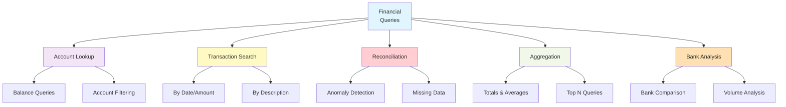
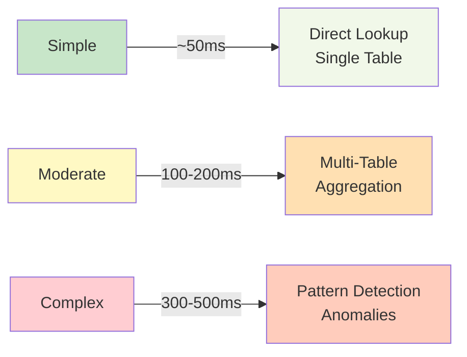

# Sample Questions — TBX Finance Assistant

> 📚 **Full Docs**: See [DOCS.md](DOCS.md) for complete guide index

Grounded in the actual `bank` / `account` / `transaction` dataset (`data/small/*.csv`). Use these to test the assistant or as UI example prompts.

## Question Categories

## Account balance & lookup

- What's the available balance for account 50200013729069?
- Show me all accounts at HDFC BANK LIMITED.
- Which accounts have a negative available balance?
- List all accounts under program 21.
- What bank does account number 30123456789012 belong to?

## Transaction search

- Show me all debit transactions for account 50200013729069.
- List the last 10 transactions for account 60100112233445.
- Find transactions with description containing "SELECTION ELECTRONICS".
- Show all credit transactions above ₹100,000 in December 2025.
- What transactions happened on 2026-06-24 for account 50200013729069?

## Reconciliation & anomalies

- Show me unreconciled transactions in Q3 2026.
- Which transactions have a missing transaction_reference_id?
- Flag any transactions above ₹500,000 as high-value anomalies.
- Are there duplicate UTR numbers across transactions?
- Which accounts have unusually large debit transactions this month?

## Aggregation & totals

- What is the total debit amount for account acfbe204-7541-492c-a352-040aa984bedc?
- What's the total transaction volume per bank?
- List the top 10 accounts by total credit amount.
- Compare total debits vs credits for HDFC accounts.
- What is the average transaction amount by transaction_type?

## Bank-level questions

- List all banks in the system.
- How many accounts does UNION BANK OF INDIA have?
- Which bank has the highest total available balance across its accounts?
- Show total transaction count grouped by bank_code.

## Notes

### Query Complexity Levels

### Data Privacy Notes

- `account_number` and `utr_number` are treated as sensitive — the assistant should mask them in responses rather than echoing raw values.
- `transaction_reference_id` is plaintext and safe to search directly; don't confuse it with `utr_number` unless the user explicitly says "UTR".
- Dates in the dataset span late 2025–mid 2026; adjust "Q3"/"this month" style questions accordingly when testing.
