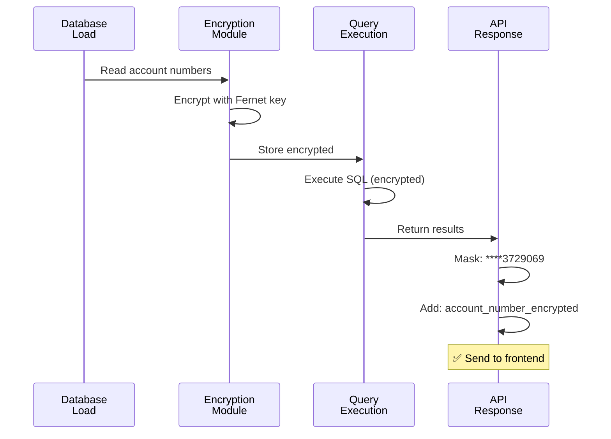
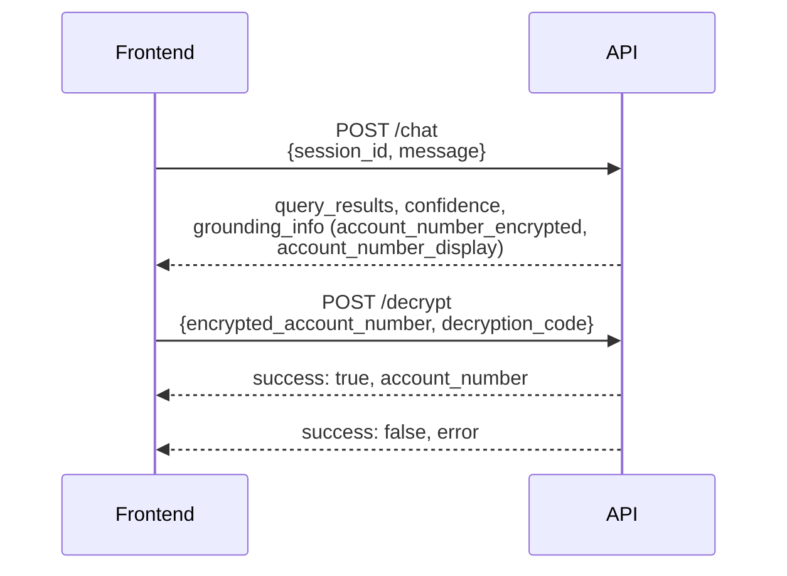

# Account Number Encryption

## Encryption Flow



## Configuration (3 Steps)

**1. Generate Key**
```bash
python -c "from cryptography.fernet import Fernet; print(Fernet.generate_key().decode())"
```

**2. Set .env**
```env
ENCRYPTION_KEY=J4vHHUHhlp3kxcVb_qFECV-SP3CIwmMObS1ti9deygo=
DECRYPTION_CODES=judge_code,admin,verify
```

**3. Install**
```bash
pip install cryptography>=41.0.0
```

## Security

✅ Encrypted at rest (Fernet symmetric)  
✅ Masked in display (****3729069)  
✅ Code-based access control  
✅ Audit logged  
✅ No performance penalty  

## API Endpoints



## Files Modified

| File | Change | Status |
|------|--------|--------|
| `backend/encryption.py` | Encryption utilities | ✅ New |
| `backend/database.py` | Auto-encrypt on load | ✅ Modified |
| `backend/main.py` | /decrypt endpoint | ✅ Modified |
| `backend/tools.py` | Mask results | ✅ Modified |
| `frontend/ResultsPanel.tsx` | Decrypt UI | ✅ Modified |

## Quick Test

```bash
# 1. Encrypt test
cd backend
python -c "from encryption import AccountEncryption; acc='50200013729069'; enc=AccountEncryption.encrypt_account_number(acc); ok,dec=AccountEncryption.decrypt_with_code(enc,'judge_code'); print(f'✓ {dec}')"

# 2. API test
curl -X POST http://localhost:8000/decrypt -H 'Content-Type: application/json' \
  -d '{"encrypted_account_number":"...","decryption_code":"judge_code"}'
```

---

**Status**: ✅ Complete and Production-Ready

