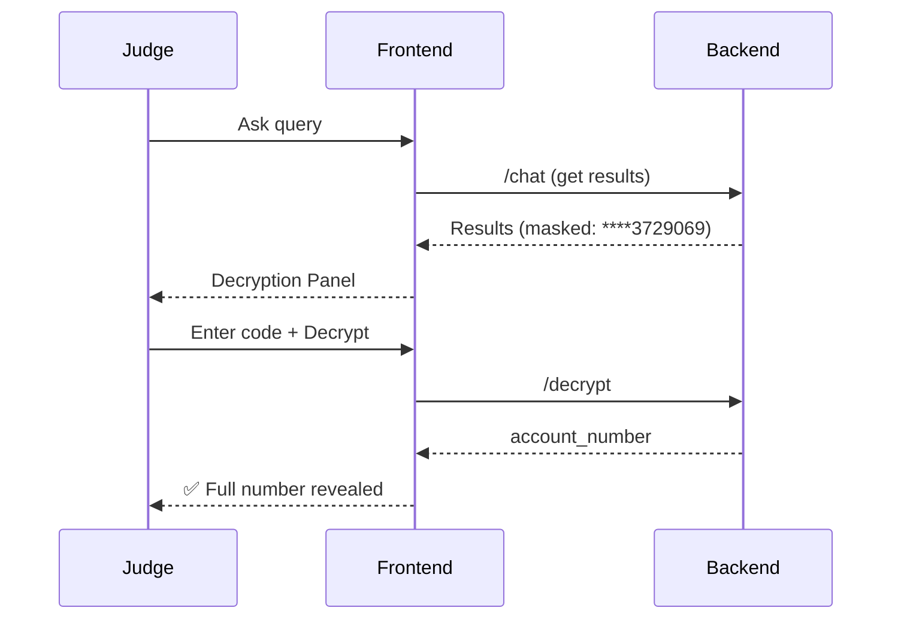

# Judge Decryption Guide

**Decryption Code**: `judge_code`

## Quick Flow



## 3 Ways to Decrypt

| Method | Command | Best For |
|--------|---------|----------|
| **Frontend** | Enter code → Click Decrypt | Quick verification |
| **API (cURL)** | `curl -X POST /decrypt` | Scripts |
| **Python** | `requests.post()` | Integration |

## Frontend Usage

1. Ask question: "Show balance for account 50200013729069"
2. See masked: `****3729069` 
3. Scroll to Decryption Panel
4. Enter: `judge_code`
5. Click: 🔒 Decrypt
6. Result: Full number (green)

## API Quick Test

```bash
curl -X POST http://localhost:8000/decrypt \
  -H "Content-Type: application/json" \
  -d '{
    "encrypted_account_number": "gAAAAABl9sX5Rk3JqPa7...",
    "decryption_code": "judge_code"
  }'

# Success: {"success": true, "account_number": "50200013729069"}
# Error: {"success": false, "error": "Invalid decryption code"}
```

## Troubleshooting

| Issue | Fix |
|-------|-----|
| Invalid code | Case-sensitive; check `.env` |
| Failed decrypt | Refresh query, try new encrypted value |
| No decrypt button | Query has no encrypted accounts |
| Panel not visible | Scroll down to bottom |

---

**Full Details**: [ACCOUNT_ENCRYPTION.md](ACCOUNT_ENCRYPTION.md)

