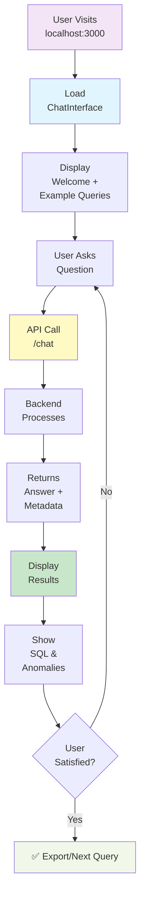
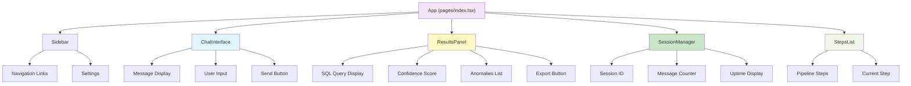
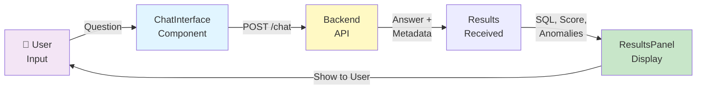

# TBX Finance Assistant - React Frontend

> 📚 **Full Docs**: See [../DOCS.md](../DOCS.md) for complete guide index  
> **Main README**: See [../README.md](../README.md) for backend & architecture

A modern React/Next.js frontend for the TBX Finance Assistant with real-time chat, session management, and results visualization.

## Features

✨ **Real-time Chat Interface** - Ask questions and get instant financial insights  
📊 **Results Panel** - View SQL queries, confidence scores, and detected anomalies  
💾 **Session Management** - Persistent multi-turn conversations  
🎨 **Responsive Design** - Works seamlessly on desktop and mobile  
🔐 **Type-Safe** - Full TypeScript support

## Project Structure

```
frontend/
├── pages/
│   └── index.tsx              # Main chat interface
├── components/
│   ├── ChatInterface.tsx       # Message display + input
│   ├── ResultsPanel.tsx        # Answer details + grounding
│   └── SessionManager.tsx      # Session info display
├── lib/
│   └── types.ts               # TypeScript interfaces
├── styles/
│   ├── globals.css            # Global styles
│   ├── Home.module.css        # Main layout
│   ├── ChatInterface.module.css
│   ├── ResultsPanel.module.css
│   └── SessionManager.module.css
├── package.json
├── tsconfig.json
├── next.config.js
└── README.md
```

## Setup

### User Journey & Setup Flow



### Prerequisites
- Node.js 18+ or npm 9+
- Backend API running at `http://localhost:8000`

### Installation

```bash
cd frontend
npm install
```

### Environment

Create `.env.local`:
```
NEXT_PUBLIC_API_URL=http://localhost:8000
```

### Development

```bash
npm run dev
```

Visit: `http://localhost:3000`

### Production Build

```bash
npm run build
npm start
```

## Usage

1. **Ask Questions**: Type natural language queries about your financial data
2. **View Results**: See answers with SQL queries and confidence scores
3. **Detect Anomalies**: Automatically flagged unusual transactions
4. **Export Data**: Download results as CSV

## Example Queries

```
"What's the current balance for account 1001-2345?"
"Show me unreconciled transactions in Q3"
"Which accounts have unusual transaction patterns?"
"List top 10 accounts by transaction volume"
"Compare Q2 and Q3 transaction totals"
```

## API Integration

The frontend connects to the backend FastAPI server:

- **Create Session**: `POST /sessions/create`
- **Send Message**: `POST /chat`
- **Get Session**: `GET /sessions/{id}`
- **Export Results**: `POST /export`

See [backend README](../README.md) for API documentation.

## Components

### Component Tree



### Data Flow



### ChatInterface
- Message display with user/assistant styling
- Auto-scrolling to latest message
- Loading state with animation
- Input field with send button
- Welcome screen with example queries

### ResultsPanel
- Confidence score visualization
- SQL query display
- Anomaly list with severity
- Export button
- Grounding information

### SessionManager
- Session ID display
- Message counter
- Session uptime
- Copy to clipboard

## Styling

Uses CSS Modules for component-level styling:
- Responsive design (mobile-first)
- Gradient background
- Custom scrollbars
- Smooth animations
- Accessibility-friendly colors

## TypeScript Types

All components use strict TypeScript with custom types:
- `ChatMessage` - User/assistant message
- `FinanceAnswer` - API response with grounding
- `Anomaly` - Detected transaction anomalies
- `GroundingInfo` - SQL query + execution metadata

## Performance

- **Code Splitting**: Automatic Next.js optimization
- **Image Optimization**: Built-in
- **CSS Optimization**: Minified in production
- **API Caching**: Session-based (Redis backend)

## Browser Support

- Chrome/Edge 90+
- Firefox 88+
- Safari 14+

## Troubleshooting

### Backend not responding
```bash
# Check if backend is running
curl http://localhost:8000/health
```

### CORS errors
```bash
# Backend needs CORS enabled in main.py
# Should be added by default
```

### Port already in use
```bash
npm run dev -- -p 3001  # Use different port
```

## Development

### Running Type Check
```bash
npm run type-check
```

### Running Linter
```bash
npm run lint
```

### Building
```bash
npm run build
```

## Next Steps

- [ ] Add WebSocket support for streaming responses
- [ ] Implement prompt caching
- [ ] Add multi-language support
- [ ] Create admin dashboard
- [ ] Add authentication
- [ ] Implement offline mode

## License

Same as main project

## Support

See [ARCHITECTURE.md](../ARCHITECTURE.md) for technical details.
